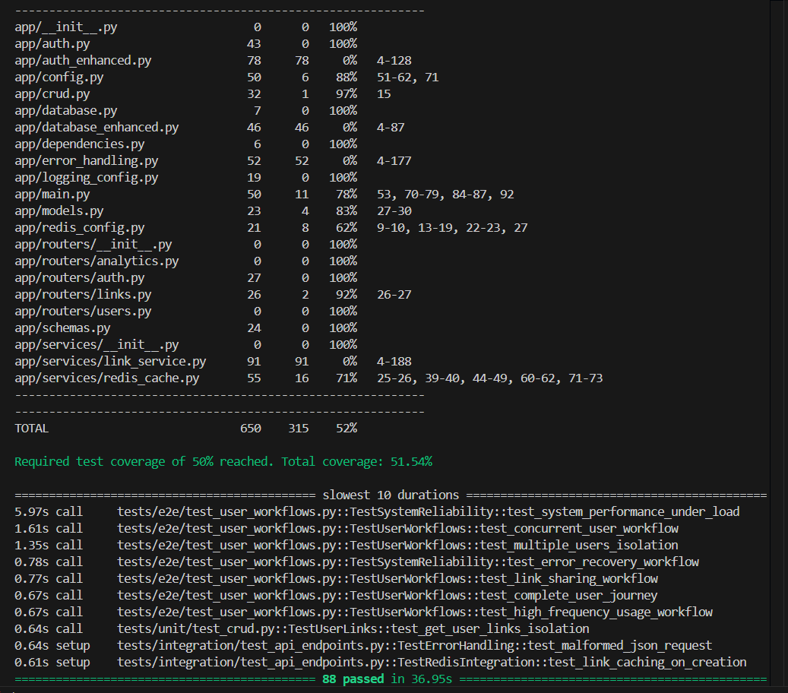

# Linkly - URL Shortener API

Linkly is a modern URL shortening service built with FastAPI, featuring user authentication, analytics, and Redis caching for high performance.

## Features

- **URL Shortening**: Create short, memorable links for any URL
- **User Authentication**: Secure signup and login with JWT tokens
- **Analytics**: Track click counts and usage statistics for each link
- **Redis Caching**: High-performance caching for frequently accessed links
- **RESTful API**: Clean and well-documented API endpoints
- **Docker Support**: Easy deployment with Docker and Docker Compose

## Tech Stack

- **Backend**: FastAPI (Python 3.11)
- **Database**: PostgreSQL 13
- **Caching**: Redis 7
- **Authentication**: JWT with OAuth2
- **Testing**: pytest with coverage reporting
- **Containerization**: Docker & Docker Compose

## Getting Started

### Prerequisites

- Docker and Docker Compose
- Python 3.11+ (for local development)


### Running with Docker & Makefile

1. Clone the repository:
   ```bash
   git clone https://github.com/kemechial/Linkly.git
   cd Linkly
   ```

2. Build and start all services (API, PostgreSQL, Redis) using Makefile:
   ```bash
   # Build Docker images
   make build

   # Start all services in detached mode
   make up

   # Stop all services
   make down
   ```

3. View logs:
   ```bash
   make logs
   ```

4. Development server:
   ```bash
   make dev
   ```

5. Redis Monitoring Visualization:
   

The API will be available at `http://localhost:8000`. You can access the interactive API documentation at `http://localhost:8000/docs`.


### Running Tests

All tests and code quality checks are run inside Docker containers using the Makefile for consistency and production parity.

**Common test commands:**

```bash
# Run all tests
make test

# Run unit tests only
make test-unit

# Run integration tests only
make test-integration

# Run end-to-end tests
make test-e2e

# Run tests with coverage report
make test-coverage

# Run tests in watch mode
make test-watch

# Run performance tests
make test-performance

# Run all code quality checks
make lint

# Format code
make format

# Check code formatting
make format-check

# Run security checks
make security

# Run type checking
make type-check
```

For a detailed guide on the testing infrastructure, test types, automation, and CI/CD, see the [Testing Guide](./TESTING_GUIDE.md).

## API Endpoints

### Authentication

- `POST /auth/signup` - Create a new user account
- `POST /auth/token` - Login and get access token
- `GET /auth/me` - Get current user information

### Links

- `POST /links/` - Create a new short link
- `GET /links/me` - List all links created by the current user
- `GET /links/{short_key}/stats` - Get statistics for a specific link
- `GET /{short_key}` - Redirect to the target URL

## Environment Variables

- `POSTGRES_USER` - PostgreSQL username
- `POSTGRES_PASSWORD` - PostgreSQL password
- `POSTGRES_DB` - PostgreSQL database name
- `POSTGRES_HOST` - PostgreSQL host
- `DATABASE_URL` - Full PostgreSQL connection URL
- `REDIS_HOST` - Redis host
- `REDIS_PORT` - Redis port
- `TEST_MODE` - Enable test mode (for testing)

## Project Structure

```
Linkly/
├── app/
│   ├── routers/
│   │   ├── analytics.py
│   │   ├── auth.py
│   │   ├── links.py
│   │   └── users.py
│   ├── services/
│   │   └── redis_cache.py
│   ├── auth.py
│   ├── crud.py
│   ├── database.py
│   ├── dependencies.py
│   ├── main.py
│   ├── models.py
│   └── schemas.py
├── tests/
│   ├── test_endpoints.py
│   └── test_main.py
├── docker-compose.yaml
├── docker-compose.test.yaml
└── requirements.txt
```

## Development

1. Create a virtual environment:
   ```bash
   python -m venv venv
   source venv/bin/activate  # Linux/Mac
   # or
   .\venv\Scripts\activate  # Windows
   ```

2. Install dependencies:
   ```bash
   # Install all dependencies
   pip install -r requirements.txt

   # Update all dependencies
   pip install --upgrade -r requirements.txt

   # Install development dependencies
   pip install pytest pytest-cov black flake8
   ```

3. Run the development server:
   ```bash
   # Basic run
   uvicorn app.main:app

   # Development mode with auto-reload
   uvicorn app.main:app --reload

   # Specify host and port
   uvicorn app.main:app --host 0.0.0.0 --port 8000

   # Enable debug logging
   uvicorn app.main:app --reload --log-level debug
   ```

4. Code formatting and linting:
   ```bash
   # Format code with black
   black app/
   black tests/

   # Run flake8 linting
   flake8 app/
   flake8 tests/
   ```

5. Database operations:
   ```bash
   # Access PostgreSQL CLI
   docker compose exec db psql -U postgres -d linkly

   # Create a new database
   docker compose exec db psql -U postgres -c "CREATE DATABASE linkly_dev;"

   # Run database migrations (when implemented)
   alembic upgrade head
   ```

6. Redis operations:
   ```bash
   # Access Redis CLI
   docker compose exec redis redis-cli

   # Monitor Redis commands
   docker compose exec redis redis-cli monitor

   # Clear Redis cache
   docker compose exec redis redis-cli FLUSHALL
   ```


## Testing



The project includes comprehensive tests covering:
- User authentication
- Link creation and management
- Redis caching
- Click tracking and analytics

Current test coverage: 83%

See the [Testing Guide](./TESTING_GUIDE.md) for:
- Test architecture and structure
- Makefile and automation commands
- CI/CD pipeline details
- Code quality and performance testing


## Contributing

1. Fork the repository
2. Create your feature branch (`git checkout -b feature/amazing-feature`)
3. Commit your changes (`git commit -m 'Add some amazing feature'`)
4. Push to the branch (`git push origin feature/amazing-feature`)
5. Open a Pull Request

## License

This project is licensed under the MIT License - see the LICENSE file for details.
